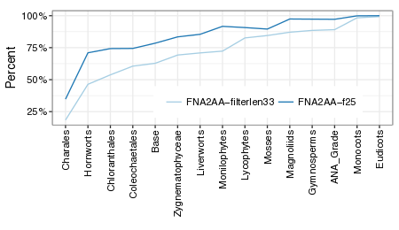

# DiscoVista

DiscoVista (Discordance Visualization Tool) is a command-line software package for visualizing phylogenetic discordance. The package is written by Erfan Sayyari and Siavash Mirarab.

## INSTALLATION:

### Simpler option (preferred): using docker

Since DiscoVista has several dependencies, direct installation might be difficult and time consuming; therefore, we have created a docker image automatically linked to the [DiscoVista github repository](https://github.com/smirarab/ASTRAL/tree/DiscoVista).

Docker is a software container platform (almost like a virtual machine system) that greatly simplifies installation. To use the docker installation of DiscoVista, you should first install [docker](https://www.docker.com) and then pull the docker image from the dockerhub. That is it; you will be ready to use DiscoVista.

Here is what you need to do:

1. Install docker following the instractions for [Mac](https://docs.docker.com/docker-for-mac/install/), [Windows](https://docs.docker.com/docker-for-windows/install/), or [Ubuntu](https://docs.docker.com/engine/installation/linux/docker-ce/ubuntu/). If you have other operating systems look [here](https://www.docker.com/community-edition) for more details.
* After installation and running the docker, you should pull docker with this command inside a terminal:
  ```bash
  docker pull esayyari/discovista
  ```
  This will pull the image.
* Then you can run DiscoVista following this command:
  ```bash
  docker run -v <absolute path to data folder>:/data esayyari/discovista discoVista.py [OPTIONS]
  ```
By using `-v` we mount the data folder to /data folder inside the container, and all the changes and figures that DiscoVista creates will be available inside this folder. Also note that, `\<absolute path to data folder\>` is an aboslute path, and program assumes that data is mounted under `/data` inside container.

### Difficault option: installation from source code
The software package __DiscoVista__ depends on several R and python packages. You could install __DiscoVista__ in a couple of steps:

1. Clone to [__DiscoVista__](https://github.com/esayyari/DiscoVista) git repository or download [this](https://github.com/esayyari/DiscoVista/archive/master.zip) zip file.

* Then you need to set environmental variable `WS_HOME` to the directory under which __DiscoVista__ repository is placed. For example, if you clone to DiscoVista and placed it under the `/Users/Erfan/reposiotry` folder, then you would export `WS_HOME` as `/Users/Erfan/reposiotry`.

* Then you need to install the dependencies described below.

#### R dependencies
For instruction on installing R please see [this page](https://www.r-project.org).
After installing R, there are several R packages that you need to install. The R package dependencies are: __Reshape__, __Reshape2__, __ggplot2__, __plyr__, __scales__, __ape__, and __optparse__.

To install these packages you need to use the following command in R:

```R
install.packages(c("Reshape","Reshape2","ggplot2","plyr","scales","ape","optparse"))
```

#### Python dependency
You need to install __DendroPy>=4.2.0__. In Mac or Linux, you would use __pip__ to install DendroPy. If you have root access, you could use:

```bash
sudo pip install dendropy
```

otherwise, you would install dendropy with the command:

```bash
pip install dendropy --user
```


## How does DiscoVista work?

The main utility to run DiscoVista is `discoVista.py`. To use this utility in command-line you would use:

```
Usage: discoVista.py [options]

Options:
  -h, --help            show this help message and exit
  -a ANNOTATION, --annotation=ANNOTATION
                        The annotation file
  -c CLADES, --clades=CLADES
                        The path to the clades definition file
  -m MODE, --mode=MODE  Specifies the analysis to perform. To
                        summarize species tree use 0.  To summarize gene
                        trees use 1 . For GC stat analysis use 2. For occupancy
                        analysis use 3. For frequency analysis use 5.
  -p PATH, --path=PATH  path to the gene directory or species tree
  -r ROOT, --rooting=ROOT
                        The rooting file
  -s STYLE, --style=STYLE
                        The color style set
  -t THRESH, --threshold=THRESH
                        The bootstrap threshold
  -x MODELCOND, --modelCond=MODELCOND
                        The model condition that the occupancy map will be
                        plotted for
  -y NEWMODEL           The new order for model conditions
  -w NEWORDER           The new order for clades
  -k MISSING, --missing=MISSING
                        The missing data handling flag. If this flag set to
                        one, clades with partially missing taxa are considered
                        as complete.
  -o LABEL, --output=LABEL
                        name of the output folder for the relative frequency
                        analysis. If you are using the docker it should start
                        with '/data'.
  -g OUTG, --outgroup=OUTG
                        Name of the outgroup for the hypothesis in relative
                        frequency analysis specified in the annotation file,
                        eg. Outgroup or Base.
```

### Input files
Several types of inputs (in addition to gene trees and species trees) need to be provided to DiscoVista (but a subset may be needed for any visualization).

1. *The annotation file* (`-a file`). In each line of this file, you need the taxon name and the corresponding clade name that species belongs to. Use tab as the field separator. You would find an example of annotation file [here](https://github.com/esayyari/DiscoVista/blob/master/example/1KP/parameters/annotation.txt). This file is used with occupancy and frequency analyses. 
2.  *The rooting file* (`-r file`). Let's say that you have an *outgroup* clade. On each line of this file, the set of species in an outgroup clade is listed. The set of species on the first line belongs to the species that are the most distant species to the ingroup species. The next line belongs species in the outgroups which are the second most distant species to the ingroup species, and so on. We root at the first outgroup clade; if not, will move to the second, third, and so on. Note that most analyses do not need an outgroup. You would find an example of annotation file [here](https://github.com/esayyari/DiscoVista/blob/master/example/1KP/parameters/rooting.txt). This is only used with the 
3. *Clade definitions* (`-c CLADE`). In this file the user can easily combine taxa into groups of interest and give the groups names. Each split is a bipartition of the taxa into two groups and corresponds to an edge in an unrooted tree. The user can specify one side of a split (which would be a clade if the side that doesn't include the root is given). With careful definition of splits, alternative hypotheses of interests could be specified. You would find an example of annotation file [here](https://github.com/esayyari/DiscoVista/blob/master/example/1KP/parameters/clade-defs.txt). Also, an auxiliary tool to generate this clade definition file in made available under `DiscoVista/src/utils/generate_clade-defs.py`. We further elaborate on the contents of this file below.  

### The clade definition file
Each line of the clade definition file defines a clade of potential interest.
The file has several columns:

* __Clade Name__ defines the name of a clade
* __Clade Definition__ is the list of species or other clades in this clade. You could use **+** or **-** signs to define a new clade based on previous ones.
* __Section Letter__ is an arbitrary name that you can use to group the clades together. If there is no natural grouping of  clades, leave it blank. Clades of the same group will appear together in the figures.
* __Components__ The list of important species or clades that together define the clade. If one of these species or clades is completely missed, the clade will be considered as missing. This is useful to indicate that if all species in some part of the clade are missing, it is not meaningful to talk about that clade anymore.
* __Show__ is a 0/1 variable. If this is 1, that clade will be shown in the graphs, otherwise, this clade will not be shown.
* __Comments__ free form comments about the clade.

We have provided a python code `generate_clade-defs.py` that could be used to generate the clade definition file from the annotation file. You can use it using the command:

```bash
generate_clade-defs.py [annotation file] [outputfile] [Other clades file]
```

This will create one clade for every value in the second column of the annotation file.
Using `other clades file`, you could define other important branches of the expected tree. Let's say that in your annotation file you have two clades **A**, and **B**, and you are interested in a clade that unites **A** and **B**. Then you would define it with **A+B** in this file.

## Using DiscoVista
Throughout this tutorial, we assume that you are using bash, and your current directory is `$WS_HOME/DiscoVista/`.

The tutorial is going to use a sample plant dataset from the Wickett, et al., 2014, PNAS.
The sample dataset and the corresponding [result](https://github.com/esayyari/DiscoVista/tree/master/example) figures for each of the DiscoVista analyses are included [as part of the package](example/). Also, there is a [README file](example/README.md) which describes the data folder structure, the parameters, and exact commands used for each analysis on the sample dataset.

For the tutorial, we assume the rooting definitions are listed in `rooting.txt`, the annotation file is `annotation.txt`, and the clade definition file is `clade-definition.txt`. For our example
dataset, these files can be found under the **`$WS_HOME/DiscoVista/parameter`** folder. Also,  we assume that the output will be written under `<the analysis folder>/results` folder.

### 1. Discordance analysis on species trees
To perform discordance analysis on species trees, you need species trees with support values draw on the branches and represented in the Newick format as node labels. For drawing bootstrap support values  on branches we highly recommend using [newick utilities](http://cegg.unige.ch/newick_utils). Please double check the support values after rerooting with our tool using any graphical viewing software like [FigTree](http://tree.bio.ed.ac.uk/software/figtree/) to be sure support values are correctly drawn and rerooting was correct.


* Species trees should be stored following this structure **`path/MODEL_CONDITION-DST/estimated_species_tree.tree`**. Here __`path`__ points to the directory where species trees are located. Put each estimated species tree inferred with different methods under a different directory. The name of these directories should follow **`model_condition-data_sequence_type`**. For example, if you have different filtering strategies for your nucleotide acid sequences and then the gene trees are inferred using [RAxML](http://sco.h-its.org/exelixis/web/software/raxml/index.html), you may use `RAxML_highly_filtered-NA`.  Please only use **"-"** to separate the model condition from the data sequence type.

* Let's assume that the support values are drawn on branches of the species tree available at path `\path`, and there are 3 model conditions, RAxML\_highly\_filtered-NA, RAxML\_med\_filtered-NA, and RAxML\_highly\_filtered-NA. Also, assume that you consider branches with support above 95 as highly supported branches, and the code will contract branches below that. Then you would call the software in bash using the following command:

```bash
./discoVista.py -m 0 -c clades-def.txt -p $path -t 95 -o $path/results
```


* Using docker:

```bash
docker run -v <absolute path to data folder>:/data esayyari/discovista discoVista.py discoVista.py -m 0 -c clades-def.txt -p $path -t 95 -o $path/results
```


* If you are using local posterior probabilities instead of bootstrap, and let's assume that the branches above the threshold of 0.95 should be considered as highly supported, then you can run:

```bash
./discoVista.py -m 0  -c parameter/clades-def.txt -p $path  -t 0.95 -o $path/results
```

*  Using docker:

```bash
docker run -v <absolute path to data folder>:/data esayyari/discovista discoVista.py -m 0 -c /data/parameter/clades-def.txt -p $path  -t 0.95 -o $path/results
```


Here are the example outputs:

![alt text][species-shade]

[species-shade]: example/figures/species/FNA2AA.block-shades.png ""

In this figure rows correspond to major orders and clades, and columns correspond to the results of different methods of the plant dataset. The spectrum of blue-green indicates amount of MLBS values for monophyletic clades. Weakly rejected clades correspond to clades that are not present in the tree, but are compatible if low support branches (below 90%) are contracted

![alt text][species]

[species]: example/figures/species/FNA2AA.block.png ""

In this figure rows correspond to major orders and clades, and columns correspond to the results of different methods ofthe plants dataset. Weakly rejected clades correspond to clades that are not present in the tree, but are compatible if low support branches (below 90%) are contracted.


### 2. Discordance analysis on gene trees

To perform discordance analysis on gene trees, you need gene trees with the MLBS values draw on the branches and represented in the Newick format as node labels. For drawing bootstrap support on branches we highly recommend using [newick utilities](http://cegg.unige.ch/newick_utils).

* Gene trees should be stored using this structure **`path/GENE_ID/GENE_ID-MODEL_CONDITION-DST/estimated_gene_trees.tree`**. Here `path` points to the directory that gene trees are located. Please only use **"-"** to separate the gene ID, model condition, and data sequence type. Put each estimated gene tree inferred with different methods for the different gene under different directories. The name of these directories should follow **`GENE_ID-model_condition-data_sequence_type`**.

* Note that you should do this analysis for each model condition separately.

* Let's assume that the MLBS values are drawn on branches of the gene trees of model condition `RAxML_highly_filtered-NA` available at path **path**. Also, assume that you consider branches with MLBS above 75 as highly supported branches, and the code will contract branches below that. Then you would call the software in bash using the following command:

```bash
./discoVista.py -m 1 -c parameter/clades-def.txt -p $path -t 75 -o $path/results
```

* Using docker:

```bash
docker run -v <absolute path to data folder>:/data esayyari/discovista discoVista.py -m 1 -c /data/parameter/clades-def.txt -p $path -t 75  -o $path/results
```

Here are some example outputs of this analysis:

![alt text][gt-portion]

[gt-portion]: example/figures/genetrees/Monophyletic_Bargraphs_Porportion.png ""


This figure shows the portion of RAxML genes for which important clades (x-axis) are highly (weakly) supported or rejected for three model conditions of the plants dataset. FAA-filterlen33: gene trees on amino acids sequences, and fragmentary sequences removed (66% gaps or more) FNA2AA-f25: amino acid sequences back translated to DNA, and sequences on long branches (25X median branch length)removed; FNA2AA-filterlen33: amino acid sequences back translated to DNA, and fragmentary sequences removed (66% gaps or more). Weakly rejected clades are those that are not in the tree but are compatible if low support branches (below 75%) are contracted.


![alt text][gt]

[gt]: example/figures/genetrees/Monophyletic_Bargraphs.png ""

This figure shows the number of RAxML genes for which important clades (x-axis) are highly (weakly) supported or rejected or are missing of three model conditions (same as above) of the plants dataset. Weakly rejected clades are those that are not in the tree but are compatible if low support branches (below 75%) are contracted.


### 3. GC content analysis
* GC content analysis shows the ratio of GC content (to the number of A, C, G, T's) in first codon position, second codon position, third codon position, and all together across different species. For satisfying stationary assumption in DNA sequence evolution models, we expect that these ratios be close to identical across all species for each codon position separately. This might not be true for the third codon, which suggests removing the third codon position might help gene tree inferences.
* For GC content analysis use this structure **path/GENE_ID/DST-alignment-noFilter.fasta**, where **DST** defines the data sequence type (e.g FNA, NA, etc.), and DST-alignment-noFilter.fasta is the original sequence alignment without filtering. Please use the following command in bash:

```bash
./discoVista.py -p $path -m 2 -o $path/results
```

* Using docker:

```bash
docker run -v <absolute path to data folder>:/data esayyari/discovista discoVista.py -p $path -m 2 -o $path/results
```

Here are some example outputs of this analysis:


![alt text][gcpt]

[gcpt]: example/figures/GC/pTpP_GC_point.png ""


This figure corresponds to the GC content analysis of the 1kp dataset. Each dot shows the average GC content ratio for each species in all (red), first (pink), second (light blue), and third (dark blue) codon positions.

![alt text][gcbox]

[gcbox]: example/figures/GC/pTpP_GC_boxplot.png ""


This figure corresponds to the GC content analysis of the 1kp dataset, using boxplots for first, second, third, as well as all three codon positions.

### 4. Occupancy analysis
* To see the occupancy of different species or clades in different genes you would use this analysis.
* For this analysis use this structure to have the sequence alignments, **path/GENE\_ID/DST-alignment-MODEL\_CONDITION.fasta**, where **MODE\_CONDITION** defines the model condition that the sequence is generated based on. Then you would use this command:

```bash
 ./discoVista.py -p $path -m 3 -a parameter/annotation.txt -o $path/results
```

 * Using docker:


```bash
docker run -v <absolute path to data folder>:/data esayyari/discovista discoVista.py -p $path -m 3 -a /data/parameter/annotation.txt -o $path/results
```

* If you want to have a tile graph that describes the occupancy of species for only one model condition you would use the option **-x DST-model\_condition**. For example, if you are interested in the occupancy map of your data and you used FNA as your DST in your directory names, and the model condition is noFiltered, then you can use this command:

```bash
 ./discoVista.py -p $path -m 3 -a parameter/annotation.txt -x FNA-noFiltered -o $path/results
```

* Using docker


```bash
docker run -v <absolute path to data folder>:/data esayyari/discovista discoVista.py -p $path -m 3 -a /data/parameter/annotation.txt -x FNA-noFiltered -o $path/results
```


Here are some example outputs of this analysis:

![alt text][occ]

[occ]: example/figures/occupancy/occupancy.png ""

This figure shows the occupancy analysis on the 1kp dataset over each individual species for two model conditions (described above).


<p align="center">

</p>


This figure shows the occupancy analysis on the important splits of 1kp dataset over each individual species for two model conditions (described above).

### 5. Branch support vs branch length analysis
* This analysis shows the correlation between the average of average gene MLBS values and average of average and maximum gene branch lengths for analyzing the long branch attraction and the effects of different inference methods on the reliability of gene trees.
* First, organize gene trees using this structure **path/MODEL\_CONDITION/DST-estimated\_gene\_trees.tree**, where all estimated gene trees for the model condition are concatenated. Let's say that you have 3 model conditions, noFiltered, medFiltered, and highFiltered and you use FNA as your DST, then you would use the following code:

```bash
./discoVista.py -p $path -m 4  -r parameter/rootingDef.txt -o $path/results
```

* Using docker:

* Using bash


```bash
docker run -v <absolute path to data folder>:/data esayyari/discovista discoVista.py -p $path -m 4  -r /data/parameter/rootingDef.txt -o $path/results
```


### 6. Relative frequencey analysis
DiscoVista can show frequency of all three topologies around some focal branches of the infered species trees. These figures can be used to test amount of ILS, as well as if the conditions of ILS are met or not. Before describing the inputs and outputs of this analysis note that this analysis depends on DiscoVista branch of [ASTRAL](https://github.com/smirarab/ASTRAL/tree/DiscoVista), and in future version we will merge it with the master branch of ASTRAL. If you don’t want to deal with installation difficulties you would simply use DiscoVista docker image.

In order to run this analysis you need a folder (“-p”) under which you have your estimated species tree (with the name estimated_species_tree.tree) and your gene trees all in one file (with the name estimated_gene_trees.tree). For example, in the 1KP folder we have an estimated gene tree that has 844 genes in it. The rooting of them is not important. You need the output folder (“-o”), and you need an annotation file (“-a”) where you have one line per each species which assigns each species to a major split (clade) separated by tabs. There is an optional feature (“-g”) that you might specify the root of the tree you expect from your splits to it as well, e.g. Base or Outgroup.


The output will be similar figures to what we have under the results folder of examples. But it will generate 4 different figures. One of them is named tree.pdf which has 4 different ways of showing your summarized species tree based on your annotation file, and are your guide trees. Then we have the relativeFreq.pdf, which shows the frequency of three topologies around each focal internal branches of your summarized species tree. Here are example commands to run this analysis:

```bash
./discoVista.py -p $path -m 5 -a parameter/annotation-hypo.txt -o $path/results  -g Outgroup
```

using docker:

```bash
docker run -v <absolute path to data folder>:/data esayyari/discovista discoVista.py -p $path -m 5  -a /data/parameter/annotation-hypo.txt -o $path/results -g Outgroup
```


![alt text][relfreq]

[relfreq]: example/figures/relativeFreq/relativeFreq.png ""

This figure corresponds to the DiscoVista relative frequency analysis on 1kp dataset considering 4 different hypotheses. Frequency of three topologies around focal internal branches of ASTRAL species trees using the trimmed gene trees (removing alignments with more than 66% gap characters) on first and second codon positions of amino acid alignments back translated to DNA in 1kp dataset. Main topologies are shown in red, and the other two alternative topologies are shown in blue. The dotted lines indicate the 1/3 threshold. The title of each subfigure indicates the label of the corresponding branch on the tree on the right (also generated by DiscoVista). Each internal branch has four neighboring branches which could be used to represent quartet topologies. On the x-axis the exact definition of each quartet topology is shown using the neighboring branch labels separated by “\#”.

## References

Wickett NJ, Mirarab S, Nguyen N, Warnow T, Carpenter EJ, Matasci N, Ayyampalayam S, Barker MS, Burleigh JG, Gitzendanner MA, Ruhfel BR, Wafula E, Der JP, Graham SW, Mathews S, Melkonian M, Soltis DE, Soltis PS, Miles NW, Rothfels CJ, Pokorny L, Shaw AJ, DeGironimo L, Stevenson DW, Surek B, Villarreal JC, Roure B, Philippe H, DePamphilis CW, Chen T, Deyholos MK, Baucom RS, Kutchan TM, Augustin MM, Wang J, Zhang Y, Tian Z, Yan Z, Wu X, Sun X, Wong GK-S, Leebens-Mack J. Phylotranscriptomic analysis of the origin and early diversification of land plants. Proc Natl Acad Sci. 2014 Oct 29;111(45):E4859–4868. PMCID: PMC4234587

## Bug Reports
Please contact esayyari@ucsd.edu.
